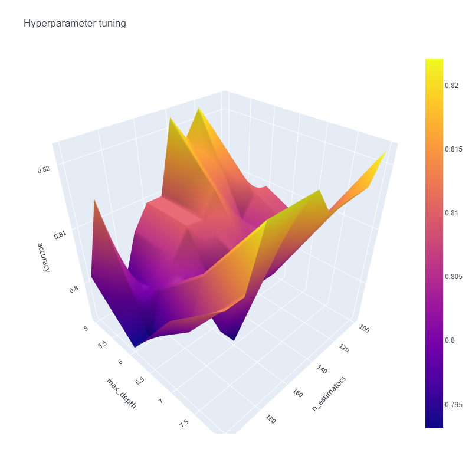

# **Interactive Hyperparameter Optimization**

## Getting Started

>
> streamlit run app.py
>

Inspired by [this blog](https://www.analyticsvidhya.com/blog/2021/09/a-hands-on-discussion-on-hyperparameter-optimization-techniques/) at Analytics Vidhya
